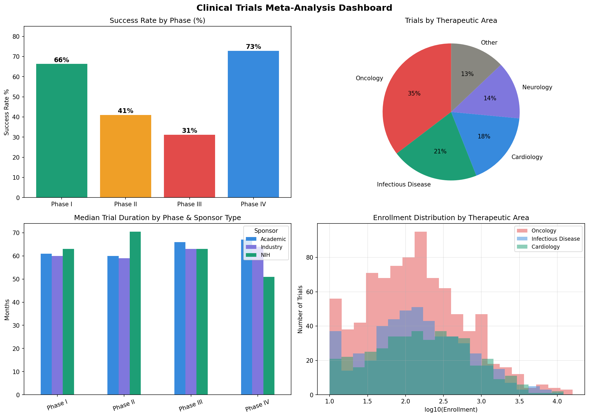

# Clinical Trials Analysis and Meta-Analysis

## Overview
This project analyzes clinical trial trends across trial phases, therapeutic areas, sponsor types, enrollment sizes, study duration, and success rates. It also includes an optional R script for fixed-effects meta-analysis and forest plot generation.

The project is designed for Data Scientist, Clinical Data Analyst, Healthcare Analytics, and Real-World Evidence portfolio use cases.

## Business Problem
Clinical development teams need to understand how trial success rates, duration, enrollment, and sponsor type vary across phases and therapeutic areas. These insights can support portfolio planning, study feasibility, and trial operations strategy.

## Dataset Note
This repository uses **synthetic/demo clinical trial data generated inside the Python and R scripts**. The structure is inspired by ClinicalTrials.gov and AACT-style clinical trial fields. The workflow can be adapted to real ClinicalTrials.gov API or AACT database extracts.

## Tech Stack
- Python: pandas, numpy, matplotlib, scipy
- R: dplyr, optional meta package
- Analytics: phase success analysis, enrollment distribution, duration trends, fixed-effects meta-analysis
- Visualization: trial dashboard chart and optional forest plot

## Repository Structure
```text
project5_clinical_trials/
├── trials_analysis.py        # Generates clinical trials dataset and EDA charts
├── meta_analysis.R           # Optional R-based meta-analysis and forest plot
├── requirements.txt          # Project-specific Python dependencies
├── results/                  # Saved outputs after running scripts
└── README.md
```

## How to Run in VS Code
Open this folder in VS Code, then run:

```bash
python3 -m venv .venv
source .venv/bin/activate
pip install --upgrade pip
pip install -r requirements.txt
mkdir -p results
```

Run the Python analysis:

```bash
python trials_analysis.py
mv -f clinical_trials.csv trials_analysis.png results/
```

Optional: run the R meta-analysis script:

```bash
Rscript meta_analysis.R
mv -f meta_analysis_data.csv forest_plot.png results/ 2>/dev/null || true
```

If the R `meta` package is missing, install it inside R:

```r
install.packages(c("meta", "dplyr"))
```

## Outputs
| Output | Description |
|---|---|
| `results/clinical_trials.csv` | Synthetic clinical trials dataset |
| `results/trials_analysis.png` | Phase, therapeutic area, duration, and enrollment analysis charts |
| `results/meta_analysis_data.csv` | Optional study-level data from R meta-analysis |
| `results/forest_plot.png` | Optional forest plot if R `meta` package is installed |

## Sample Visuals


## Key Analyses
- Success rate by trial phase
- Trial distribution by therapeutic area
- Median duration by phase and sponsor type
- Enrollment distribution by therapeutic area
- Optional fixed-effects pooled odds ratio from R meta-analysis

## Key Skills Demonstrated
- Clinical trial analytics
- Statistical analysis and meta-analysis concepts
- Python and R workflow integration
- Healthcare/life sciences data storytelling
- Dashboard-ready data preparation

## How This Project Helps
This project demonstrates the ability to analyze clinical research data, summarize study-level performance trends, build reproducible analytics workflows, and communicate findings for clinical and life sciences stakeholders.
